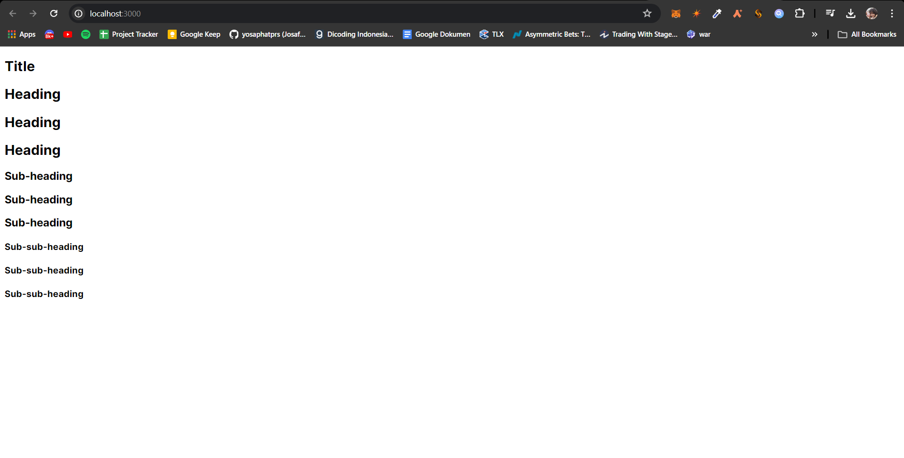
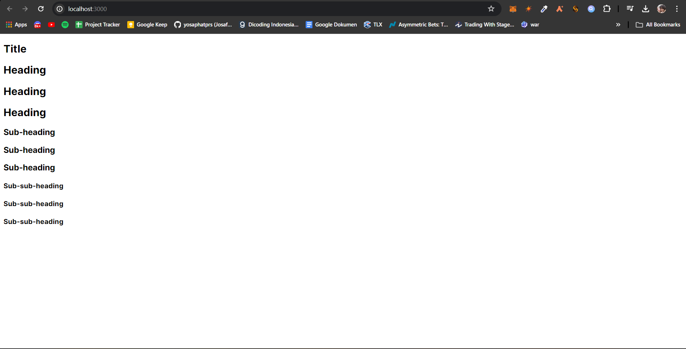
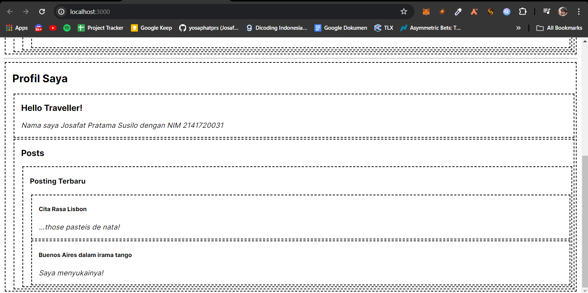
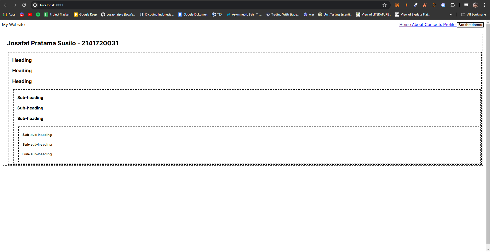
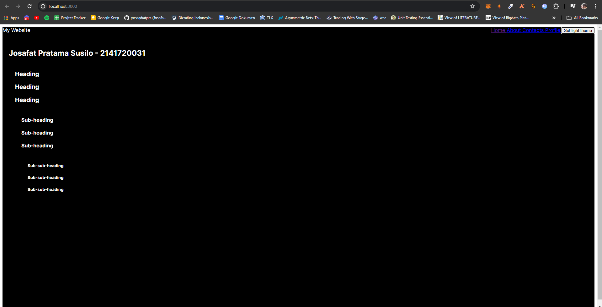
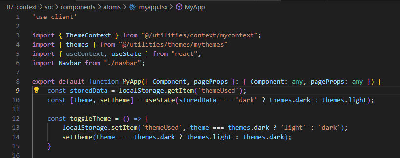

## Laporan Praktikum

|  | Pemrograman Berbasis Framework 2024 |
|--|--|
| NIM |  2141720031 |
| Nama |  Josafat Pratama Susilo |
| Kelas | TI - 3A |

### Praktikum 1

### Soal 1
Hasil:

Hal yang telah saya pelajari adalah struktur folder untuk penerapan atomic design pada react dan bagaimana cara implementasi atomic design pada react. Struktur folder atomic design terdapat 4 folder, templates yang terdiri dari beberapa organism atau molecule atau atom, kemudian organism yang terdiri dari molecules atau atoms, dan molecules yang terdiri dari beberapa atoms. Untuk atom sendiri merupakan bagian terkecil dari atomic design, umumnya mewakili 1 tag seperti button, section, heading. Kemudian untuk implementasi atomic itu dapat menggunakan children supaya konten dari komponen yang ada menjadi dinamis.

### Soal 2
Error:

Hasil akhir:

Hal yang saya pelajari adalah penerapan context sebagai salah satu cara memanfaatkan prop supaya memudahkan pengiriman data dari parent ke child. Terdapat error pada program yaitu perlu menambahkan 'use client'. Saya menyelesaikan dengan menambahkan 'use client' pada main_page.tsx.

### Soal 3
Hasil:

Hal yang saya pelajari variasi dari penerapan context, yaitu dapat diubah di dalam atribut value providernya.

### Praktikum 2

### Soal 4

Hasil:

### Praktikum 3

### Soal 5

Hasil:

Hasil:

1. Toggle button sudah berfungsi
2. Karena setiap berubah halaman maka akan membuat provider baru, sehingga context kembali ke awal yaitu light theme. Hal ini dapat diatasi dengan menyimpan context/state dari theme saat itu di dalam local storage. Berikut perubahan yang saya lakukan:

